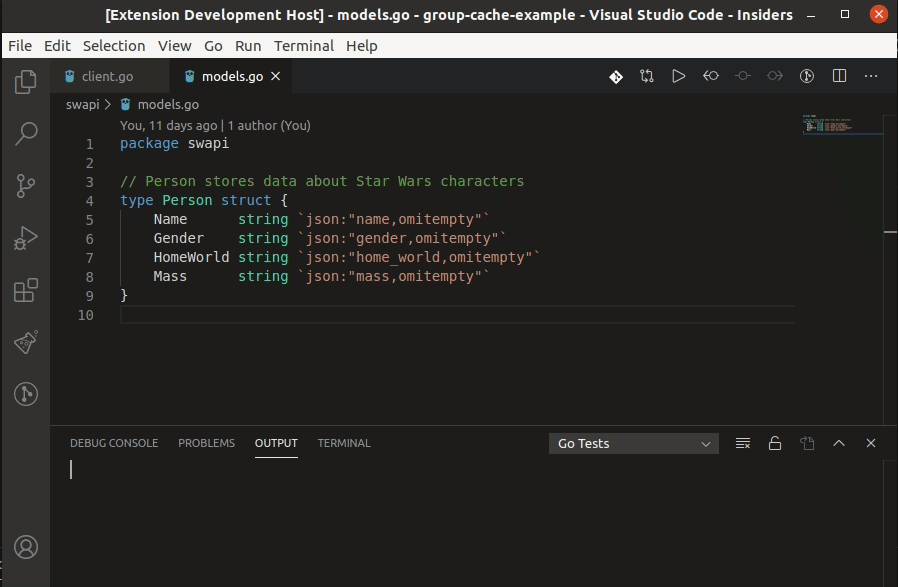

# Go Version Manager VSCode Extension README

The main idea of this extension is to allow you to install, uninstall and manage your **current used Golang version**
using VSCode.

It requires that you use Linux or Mac, and have [gvm installed](https://github.com/moovweb/gvm#installing)

## Features

### GVM: Install Go version

Use this command to install a version of Go that is not yet installed in current machine.

This will use `gvm listall`, and show all available versions to you, after that
it will install the selected version.

### GVM: Uninstall Go version

Use this command to remove a version of Go that is not yet installed in current machine.

This will use `gvm list`, and show all available versions to you, after that
it will uninstall the selected version.

### GVM: Set current version

This command will change the current version configured of Go to the selected version,
using `gvm list` to show all versions, except the currently selected version.

> If the `gvm.setVersionWithDefault` was configured as `true`, this command will do
> the same that **GVM: Set default version**

### GVM: Set default version

This command will change the current version configured of Go to the selected version,
using `gvm list` to show all versions, except the currently selected version.

## Requirements

You need to have [gvm installed](https://github.com/moovweb/gvm#installing)

## Extension Settings

This extension contributes the following settings:

`gvm.pathToDefaultTerminal`: Path to terminal, defaults to `/bin/bash`, but can be almost any shell that supports `source _script_`

`gvm.showVersionOnStatusBar`: Determine if the current GVM/Go version is shown on status bar, defaults to true

`gvm.setVersionWithDefault`: If enabled, will set current version on use with `--current`

## Known Issues

Calling out known issues can help limit users opening duplicate issues against your extension.

## Release Notes

Users appreciate release notes as you update your extension.

### 1.0.0

Initial release of the extension with basic 